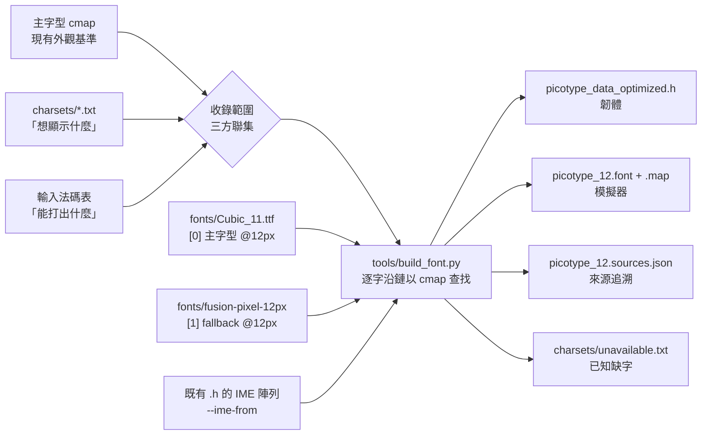

# PicoType 資料轉換工具鏈說明 (README)


## 1. 總覽 (Overview)

本工具鏈包含兩個核心的 Python 腳本：`charset_extractor.py` 和 `full_hardcode_converter.py`。它們的主要目標是將文字形式的字型檔 (TTF)、輸入法碼表、以及各種字元來源，轉換為適用於嵌入式系統 (如 Arduino、ESP32 等) 的高度優化、可直接硬編碼 (hard-code) 的 C++ 標頭檔 (`.h`)。

這樣做的主要優點是：

*   **節省資源**：在 RAM 和 Flash 有限的微控制器上，無需在執行時期解析文字檔案或字型檔。
*   **提升效能**：直接讀取預先處理好的二進位資料，遠比動態渲染字元或搜尋文字碼表來得快。
*   **客製化字庫**：可以根據專案需求，精準地打包需要的字元，大幅縮小最終韌體的體積。

> ### ⚠ 目前的主要流程已更換
>
> 字型資料已改為 **1 bit/pixel**，**不再人工挑選常用字**（改由字型 cmap 決定），
> 並加入**多字型 fallback 鏈**。現在的建置指令只有一行：
>
> ```bash
> python -X utf8 tools/build_font.py
> ```
>
> 字型部分的 flash 佔用從 **1,420.3 KB 降到 593.4 KB**，同時：
> 移除 3,119 個 `.notdef` 假字形、收錄字數從 10,915 增為 **17,052（全部是真字形）**。
> 詳細的來龍去脈見 **§7 改造紀錄**，新工具見 §4.3–4.6。
>
> 本文件 §1–§6 保留了改造前的原始說明。`charset_extractor.py` 與
> `full_hardcode_converter.py` 仍在 repo 內，但**已非主要流程** —— 保留它們是為了
> 記錄「當初為什麼要挑常用字」這段脈絡。

## 2. 工具鏈運作流程

### 2.1. 目前的流程



**收錄範圍 = ( 主字型 cmap ∪ 字表 ∪ 輸入法候選字 ) ∩ ( 鏈上任一層有字形 )。**
三個來源互不涵蓋，缺一個就會漏字 —— 完整理由見 **§8 收錄範圍的演進**。
每個字依序在鏈上查找，**一律以 cmap 查表決定由哪一層提供**。
IME 資料原樣沿用，不重建。

只想用主字型（第一階段的行為）可加 `--primary-only`。

驗證與檢視：`verify_1bpp.py`（§4.4）確認產出正確，`font_viewer.py`（§4.6）目視檢閱。

### 2.2. 舊流程（保留說明）


> 上圖描述的是**改造前的流程**，其中的「產生字元集」步驟在目前流程已移除。
> 圖仍具參考價值：它說明了 §4.1 / §4.2 這兩個工具的運作方式，以及當初為什麼
> 需要挑選常用字。

整個資料處理流程如下：

1.  **準備來源資料**: 將原始的輸入法碼表 (`.txt`)、字頻表 (`.txt`)、字型檔 (`.ttf`) 等放入對應的資料夾。
2.  **(可選) 產生字元集**:
    *   執行 `tools/charset_extractor.py`。
    *   此腳本會讀取 `ime_data/` 和其他來源的檔案，提取所有不重複的字元。
    *   產生一個精簡的字元集檔案 (例如 `charsets/chars_from_tcfreq_sc.txt`)。
3.  **轉換為硬編碼**:
    *   執行 `tools/full_hardcode_converter.py`。
    *   此腳本會：
        a. 根據設定，讀取上一步產生的**字元集檔案**。
        b. 讀取指定的**字型檔**，並只渲染字元集中包含的字元，將其轉換為點陣圖資料。
        c. 讀取**注音輸入法碼表**，將其轉換為高效查詢的二進位格式。
        d. 將上述所有二進位資料打包成一個 C++ 標頭檔 (`output_data/picotype_data_optimized.h`)。
4.  **整合至專案**: 在您的 Arduino/C++ 專案中直接 `#include "picotype_data_optimized.h"` 即可使用這些預先處理好的資料。

## 3. 目錄結構

為了讓工具鏈正常運作，建議採用以下目錄結構：

```
PicoType_Project/
│
├── arduino_project/          # 你的主要 Arduino 或 C++ 專案程式碼
│   └── ...
│
├── tools/                    # 存放本工具鏈的 Python 腳本
│   ├── build_font.py             # 目前的建置工具 (§4.3)
│   ├── verify_1bpp.py            # 產出驗證 (§4.4)
│   ├── check_pixel_font.py       # 字型設計字級判定 (§4.5)
│   ├── font_viewer.py            # 字形檢閱器 (§4.6)
│   ├── charset_extractor.py      # 舊流程
│   └── full_hardcode_converter.py # 舊流程
│
├── fonts/                    # 存放來源字型檔（fallback 鏈依序查找）
│   ├── Cubic_11.ttf                              # [0] v1.430，版本已固定
│   ├── fusion-pixel-12px-proportional-zh_hant.ttf # [1] v2026.07.20
│   └── LICENSES/
│       ├── Cubic_11-OFL.txt
│       ├── Fusion_Pixel-OFL.txt
│       └── ATTRIBUTION.md        # 字型來源、授權與版本固定的理由
│
├── ime_data/                 # 存放來源輸入法碼表、字頻表等
│   ├── BPMFBase.txt
│   ├── BPMFPunctuations.txt
│   ├── 字頻表.txt
│   └── 通用规范汉字表(2013)全部(8105字).txt
│
├── charsets/                 # 字元集，構成收錄範圍的一部分 (§8)
│   ├── chars_from_tcfreq_sc.txt  # 「想顯示什麼」(10,914 字)，見 §8
│   ├── missing_from_cubic.txt    # Cubic 11 畫不出來的 3,119 字
│   ├── unavailable.txt           # 全鏈皆無字形的 1,325 字（自動產生，已知問題）
│   └── history/                  # 字表的五個歷史版本 (2025-06 ~ 10)，見 §8.1
│
└── output_data/              # 最終產出
    ├── picotype_data_optimized.h  # 韌體用
    ├── picotype_12.font           # 模擬器用，1bpp 點陣資料
    ├── picotype_12.map            # 模擬器用，JSON 查找表
    └── picotype_12.sources.json   # 各字的來源層，僅供檢閱與驗證 (§7.8)
```

> 產出檔名刻意不含 `Cubic` —— 那是 OFL 的保留字型名稱，衍生資料不應沿用。

## 4. 各工具詳解

> §4.1 與 §4.2 是**舊流程**的工具，目前不使用。新流程見 §4.3 起。

### 4.1. `charset_extractor.py` (字元集提取工具) — 舊流程

*   **功能**:
    此工具的核心功能是從一個或多個不同格式的文字檔中，提取出所有字元，並生成一個不重複、已排序的字元集合檔案。

*   **設計理念**:
    採用「資料驅動」設計。所有的檔案來源和解析規則都定義在 `SOURCE_FILES_CONFIG` 列表中。這使得新增或修改來源檔案時，只需修改設定檔，無需更動主程式邏輯，擴充性極佳。

*   **如何使用**:
    1.  將您的來源檔案（例如碼表、文章、字頻表）放入 `ime_data/`。
    2.  編輯 `charset_extractor.py` 中的 `SOURCE_FILES_CONFIG` 列表，為每個檔案設定：
        *   `path`: 檔案路徑。
        *   `method`: 解析方法，例如 `'split'` (分割字串) 或 `'first_char'` (取第一個字元)。
        *   `delimiter`: 分隔符號 (當 `method` 為 `'split'` 時使用)。
        *   `column_index`: 要提取的欄位索引 (當 `method` 為 `'split'` 時使用)。
    3.  執行 `python tools/charset_extractor.py`。
    4.  腳本會在 `charsets/` 目錄下產生一個合併後的字元集檔案。

### 4.2. `full_hardcode_converter.py` (全功能硬編碼轉換工具) — 舊流程

*   **功能**:
    此為核心轉換工具，負責將文字資源轉換成最終的 C++ 硬編碼資料。

*   **核心概念**:
    *   **可選字元集 (`CHARSET_MODE`)**:
        *   `'FILE'`: (推薦) 使用 `charset_extractor.py` 產生的檔案作為字元集基礎。這能最大程度地客製化字庫大小。
        *   `'AUTO'`: 直接從輸入法檔案 (`IME_SOURCE_FILES`) 中提取字元，適合快速測試。
    *   **二進位優化**: 所有資料都被 `struct.pack` 轉換為緊湊的二進位格式，並使用「索引(Index) + 資料池(Pool)」的模式來節省空間和加速查詢。

*   **如何使用**:
    1.  確保 `charset_extractor.py` 已產生所需的字元集檔案 (如果使用 `'FILE'` 模式)。
    2.  編輯 `full_hardcode_converter.py` 頂部的全局配置區塊：
        *   `IME_SOURCE_FILES`: 設定注音輸入法的碼表來源。
        *   `FONT_SOURCE_PATH`: 指定要使用的 TTF 字型檔。
        *   `FONT_SIZE`: 設定要渲染的字體大小。
        *   `OUTPUT_H_FILE_PATH`: 設定最終產出的 `.h` 檔案路徑。
        *   `CHARSET_MODE` 和 `CHARSET_FILE_PATH`: 根據需求設定字元集模式及路徑。
    3.  執行 `python tools/full_hardcode_converter.py`。
    4.  腳本會在 `output_data/` 目錄下產生 `picotype_data_optimized.h`。

### 4.3. `build_font.py` (字型建置工具) — **目前使用**

*   **功能**:
    取代 §4.2 的字型部分。單一資料模型、雙輸出，一次建置同時產生韌體用的 `.h`
    與模擬器用的 `.font`/`.map`，兩者從此不可能不同步。

*   **相對舊版的五項改動**:

    1.  **不再人工挑選常用字**：收錄範圍改由三方聯集決定，並與字型能力取交集。
        詳見 §7.2 與 **§8**。
    2.  **多字型 fallback 鏈**（`FONT_CHAIN`）：主字型畫不出來的字往後面的層找，
        **一律以 cmap 查表決定**，不靠 bitmap 特徵猜測。
    3.  **1 bit/pixel、row-aligned**：原始資料雖是 1 B/px，但只有 `0x00`/`0xFF`
        兩種值，轉換無損。
    4.  **雙輸出**：`.h` 與 `.font`/`.map` 同源。
    5.  **PUA、C0/C1 控制字元排除**：`EXCLUDE_RANGES` / `EXCLUDE_CHARS`。

*   **如何使用**:

    ```bash
    python -X utf8 tools/build_font.py
    python -X utf8 tools/build_font.py --primary-only   # 只用鏈的第一層
    ```

    Windows 上 `-X utf8` 是必要的，否則中文輸出會亂碼。

*   **IME 資料不由本工具產生**:
    既有的注音產出已穩定（多份標頭檔與 `output_data/` 之間位元組完全相同），
    故本工具以 `--ime-from` 從既有標頭檔**原樣沿用** `zhuyin_*` 陣列，不重建。

*   **每個字形在建置時都會跑 round-trip `assert`**，1bpp 無損是逐字驗證的，不是抽樣。

### 4.4. `verify_1bpp.py` (產出驗證)

三項檢查，任一失敗即以非零碼結束：

1.  **round-trip** —— 把 `.h` 內的 1bpp 資料解碼回 1 B/px，與**產生它的那一層**
    重新光柵化的結果逐 byte 比對（來源取自 `picotype_12.sources.json`，見 §7.8），
    並確認 metric 校正值有正確套用。證明打包與解碼互為逆運算，且雙方對 stride、
    位元順序的認知一致。
2.  **與舊資料一致** —— 對主字型提供的字比對字形與 metric，證明改造沒有動到任何
    既有字形。由 fallback 層提供的字**本來就應該不同**（舊資料中是 `.notdef`），
    故分開統計而非計為失敗。基準檔為 1 B/px 或 1bpp 皆可，格式自動偵測。
3.  **無 notdef 殘留** —— 以各層 cmap 為準，不靠 bitmap 特徵猜測（理由見 §7.2）；
    並檢查每個字的來源標記與該層 cmap 相符。

```bash
python -X utf8 tools/verify_1bpp.py
```

### 4.5. `check_pixel_font.py` (字型設計字級判定)

**判準**：真正的點陣字型在其設計字級光柵化後，筆畫對齊 pixel grid，
**只會出現 0 與 255 兩種灰階值**。出現中間值即代表反鋸齒介入，
亦即該字型並非為此字級設計。

這個判準對本專案是決定性的：資料格式是 1 bit/pixel，若光柵化結果帶灰階，
轉換就必須做二值化門檻 —— 那是有損的，細筆畫會斷裂或消失。

```bash
python -X utf8 tools/check_pixel_font.py fonts/Cubic_11.ttf 11 12 13
```

實測結果（節錄）：

| 字型 | 乾淨的字級 | 其他字級 |
| :--- | :--- | :--- |
| Cubic 11 | **只有 @12** | @11 有 90.5% 的墨水像素是灰階 |
| Fusion Pixel 12px | **只有 @12** | @11 92.9%、@13 72.0% |
| BoutiqueBitmap9x9 | @10 | @9 88.9%、@12 59.1% |
| Unifont 16.0.04 | 只有 @16 | **@12 高達 99.9%** |
| Noto Sans TC | **沒有** | 各字級皆 100%（純 outline 字型，對照組）|

兩個推論：`FONT_SIZE = 12` 不是隨意選的，是 Cubic 11 唯一正確的字級；
而**點陣字型絕不可離開設計字級去縮放**。

### 4.6. `font_viewer.py` (字形檢閱器)

直接檢視轉換後的字形。它讀 `.font`/`.map`，也就是**韌體實際會燒進去的同一份資料**。

```bash
python -X utf8 tools/font_viewer.py
```

| 檢視 | 用途 |
| :--- | :--- |
| **字表** | 捲動瀏覽全部字形，側欄顯示選中字的 metric 與來源層 |
| **單字** | 放大帶格線，列出完整 metric 與原始位元組 |
| **對照** | 資料字形 vs 即時 TTF 光柵化，差異 pixel 標紅 |
| **缺字** | 目前畫不出來的字，框內以系統字型疊上該字供辨識 |

字形依**來源層上色**（主字型白色、fallback 層綠色），
可一眼看出哪些字是補上來的；`f` 鍵可切換成只看某一層。

| 鍵 | 功能 |
| :--- | :--- |
| 方向鍵 / PgUp / PgDn / Home / End | 移動 |
| `Enter` | 單字模式 |
| `c` | 對照模式 |
| `m` | 缺字檢視 |
| `f` | 分層檢視（全部 → 第 0 層 → 第 1 層 → …）|
| `/` | 跳至碼位（如 `4E2D`）或直接貼字 |
| `Esc` | 返回 / 離開 |

**對照模式是 §4.4 驗證器的視覺化版本** —— 驗證器只告訴你過或不過，
檢閱器讓你看出是**哪一個 pixel** 不一樣。

## 5. 產出檔案格式詳解

### 5.1. 字元集檔案 (`chars_from_tcfreq_sc.txt`)

*   **格式**: 純文字檔 (UTF-8)。
*   **內容**: 一個沒有任何分隔符號的長字串，包含了所有從來源檔案中提取出的、不重複且排序過的字元。
    例如: `!"#$%&'()*+,-./0123...一丁七...龥`

### 5.2. C++ 標頭檔 (`picotype_data_optimized.h`)

這是最核心的產出檔案，其內部資料結構經過精心設計。

#### A. 字型資料 (Font Data)

字型資料被分為兩部分：一個「對應表 (Map)」和一個「點陣圖資料池 (Bitmap Pool)」。

*   `font_map_raw_opt`: 字元對應表 (Index)。它是一個 `FontMapRecord_Opt` 結構的陣列。
*   `font_bitmap_data_1bpp`: 包含了所有字元實際的、連續存放的點陣圖資料 (Pool)。

> **符號已更名**：原本叫 `font_bitmap_data_opt`。改名是**刻意的防呆** —— 搭配
> `#define PICOTYPE_FONT_BPP 1`，舊的 1 B/px renderer 遇到新資料會**編譯失敗**，
> 而不是畫出一片雪花。錯誤的組合應該編不過。

**`struct FontMapRecord_Opt` 結構 (共 14 Bytes):**

| 欄位        | 型別     | 大小 (Bytes) | 說明                                                              |
| :---------- | :------- | :----------- | :---------------------------------------------------------------- |
| `unicode`   | `uint32_t` | 4            | 字元的 Unicode 編碼。                                               |
| `offset`    | `uint32_t` | 4            | 該字元的點陣圖資料在 `font_bitmap_data_opt` 中的起始位移(offset)。 |
| `width`     | `uint8_t`  | 1            | 字元點陣圖的寬度 (pixels)。                                       |
| `height`    | `uint8_t`  | 1            | 字元點陣圖的高度 (pixels)。                                       |
| `x_advance` | `uint8_t`  | 1            | 字元在水平方向上的總繪製寬度，用於計算下一個字元的起始位置。       |
| `x_offset`  | `int8_t`   | 1            | 字元點陣圖相對於繪製原點的水平偏移。                               |
| `y_offset`  | `int8_t`   | 1            | 字元點陣圖相對於繪製原點的垂直偏移（基線之上）。                   |
| `padding`   | `uint8_t`  | 1            | 填充位元組。                                                       |

> 原始碼中此欄位的註解曾寫「to make it 16 bytes」，**該註解是錯的** ——
> 結構加總為 14 bytes，且 `__attribute__((packed))` 本來就不會補到 16。
> `unicode` 欄位也不能縮成 `uint16_t`：資料中有 247 個字的碼位大於 `0xFFFF`。

**點陣圖格式：1 bit/pixel、row-aligned、LSB-first**

*   `bit 0` = 該位元組**最左邊**的 pixel
*   每列佔 `stride = (width + 7) / 8` 個位元組
*   第 `j` 列的起點是 `offset + j * stride`

選 row-aligned 而非 tight bitstream，是因為後者只再省約 33 KB，卻讓解碼需要跨
位元組位移；row-aligned 的解碼就是 `base + row * stride`。

標頭檔另外宣告 `#define PICOTYPE_MAX_GLYPH_BYTES`（目前為 26），韌體的
`MAX_CHAR_BUFFER_SIZE` 直接綁定它，緩衝區大小便不可能與資料脫節。

**運作方式**:
要繪製一個字元時，先透過二分搜尋法在 `font_map_opt` 中找到對應的 Unicode 紀錄，從中取得 `offset`, `width`, `height` 等資訊，然後再去 `font_bitmap_data_1bpp` 中讀取點陣圖資料，逐位元測試後繪製。

**目前的資料量**:

| 陣列 | bytes | KB |
| :--- | ---: | ---: |
| `font_bitmap_data_1bpp` | 368,894 | 360.2 |
| `font_map_raw_opt` | 238,728 | 233.1 |
| `zhuyin_idx_raw_opt` | 10,880 | 10.6 |
| `zhuyin_pool_opt` | 53,983 | 52.7 |
| **總計** | **672,485** | **656.7** |

改造前的字型部分為 1,454,392 B（1,420.3 KB），現為 607,622 B（593.4 KB），
**省下 827 KB**，同時收錄字數從 10,915 增為 17,052。

#### B. 輸入法資料 (IME Data)

輸入法資料同樣採用「索引 + 資料池」的設計，以實現高效的注音查詢。

*   `zhuyin_idx_raw_opt`: 注音索引表。它是一個 `ImeIndexRecord_Opt` 結構的陣列。
*   `zhuyin_pool_opt`: 資料池，連續存放了所有注音按鍵組合 (key) 和其對應的候選字 (candidates)。

**`struct ImeIndexRecord_Opt` 結構 (共 8 Bytes):**

| 欄位          | 型別       | 大小 (Bytes) | 說明                                                        |
| :------------ | :--------- | :----------- | :---------------------------------------------------------- |
| `key_offset`  | `uint16_t` | 2            | 注音按鍵組合在 `zhuyin_pool_opt` 中的起始位移。             |
| `key_len`     | `uint8_t`  | 1            | 注音按鍵組合的長度 (bytes)。                                |
| `padding`     | `uint8_t`  | 1            | 填充位元組，用於對齊。                                        |
| `data_offset` | `uint16_t` | 2            | 該注音對應的候選字字串在 `zhuyin_pool_opt` 中的起始位移。 |
| `data_len`    | `uint16_t` | 2            | 候選字字串的總長度 (bytes)。                                |

**運作方式**:
當使用者輸入一組注音（例如 `ㄍㄨㄤ`）時：
1.  程式將輸入的注音組合（`guang`）在 `zhuyin_idx_opt` 索引表中進行搜尋（因為索引表已排序，可使用二分搜尋）。
2.  在 `zhuyin_pool_opt` 中，根據 `key_offset` 和 `key_len` 比對，確認找到完全匹配的按鍵組合。
3.  一旦找到，就使用對應的 `data_offset` 和 `data_len` 從 `zhuyin_pool_opt` 中讀取出候選字字串（例如 "光廣逛"）。

---

## 6. 電腦端模擬與驗證工具 (main.py)

在將字型與輸入法資料部署到微控制器之前，先在電腦上進行快速的測試與驗證是個非常高效的做法。`main.py` 就是為此目的而設計的 Pygame 模擬器。

*   **目的**: 載入由 `full_hardcode_converter.py` 產生的模擬器專用檔案 (`.map`, `.font`, `.idx`, `.dat`)，在電腦上模擬一個完整的中文輸入與顯示環境。
*   **優勢**:
    *   **快速迭代**: 修改字型大小、碼表內容後，無需重新編譯和上傳韌體，即可立即看到效果。
    *   **除錯方便**: 可以在功能完善的電腦環境下，專注於除錯輸入法邏輯或字型渲染問題。
    *   **功能展示**: 可以輕鬆地錄製影片或截圖，展示專案的輸入法功能。

### 6.1. 如何執行模擬器

1.  **產生資料**: 確保已執行 `tools/build_font.py`，並在 `output_data/` 目錄下產生了模擬器所需的四個檔案。這四個檔案協同運作，構成了模擬器的資料基礎：
    *   `picotype_12.map` (**字型對應表**): 一個 JSON 格式的查找表，記錄了每個字元的 Unicode 碼、尺寸，以及它在 `.font` 檔案中的數據位置。其 `metadata.format` 目前為 `"1-bit"`（舊資料為 `"1-byte-grayscale"`），`main.py` 依此欄位決定解碼方式，新舊檔案可共存。
    *   `picotype_12.font` (**字型點陣圖資料**): 一個二進位檔案，包含了所有字元被渲染後的、連續存放的 1bpp 像素資料。格式定義見 §5.2。
    *   `zhuyin.idx` (**輸入法索引**): 一個 JSON 檔案，將注音輸入碼（如 "ㄍㄨㄤ1"）對應到其候選字在 `.dat` 檔案中的位置和長度。
    *   `zhuyin.dat` (**輸入法候選字資料**): 一個二進位檔案，連續存放了所有輸入碼對應的候選字字串，形成一個巨大的「資料池」。

2.  **安裝依賴**: 模擬器使用 Pygame 函式庫，請先透過 pip 安裝：
    ```bash
    pip install pygame
    ```
3.  **執行腳本**: 在專案根目錄下，直接執行 `main.py`：
    ```bash
    python main.py
    ```
    如果一切正常，將會看到一個 320x240 的視窗，包含輸入區、候選字區和編輯區。

### 6.2. 操作說明

*   **輸入注音**: 根據鍵盤對應直接輸入注音符號 (例如按 '1' 輸入 'ㄅ')。
*   **刪除**: 按 `Backspace` 鍵。會先刪除輸入緩衝區中的注音，如果緩衝區為空，則刪除編輯區的最後一個字。
*   **選擇候選字**:
    *   按 `1` 到 `9` 選擇當前頁對應的候選字。
    *   按 `Space` 鍵選擇第一個候選字。
*   **翻頁**:
    *   按 `→` (右方向鍵) 或 `=` 鍵翻到下一頁。
    *   按 `←` (左方向鍵) 或 `-` 鍵翻到上一頁。
*   **退出**: 按 `Escape` 鍵或關閉視窗。

---

## 7. 改造紀錄：1bpp 與整份 cmap

這個 repo 曾經處於「clone 下來跑不起來」的狀態。以下是把它修好的過程。
所有數字皆為實測，每一項都註明了測法。

### 7.1. 起點：三個問題

1.  **repo 跑不起來** —— `full_hardcode_converter.py` 讀 `../fonts/`、`../charsets/`、
    `../ime_data/`，三個目錄都沒有被 commit 進去，也沒有 `.gitignore`，就是單純漏掉。
2.  **資料格式浪費** —— 字型資料是 1 byte/pixel，但整份只有 `0x00` 和 `0xFF` 兩種值。
3.  **多條建置線各自為政** —— 同一份資料存在多種版本，字數從 10,915 到 13,841
    不等，彼此不同步。

### 7.2. 為什麼不再挑常用字

原本的流程是「人工整理常用字表 → 只轉那些字」。這帶來一個一直沒被發現的問題：
字表裡有 **3,119 個字是 Cubic 11 根本沒有的**。

字型缺字時 PIL 不會報錯，而是回傳 `.notdef`（字型的「查無此字」預設圖）。
Cubic 11 的 `.notdef` 是一個 13×5 的 2×2 點圖，而舊程式唯一的過濾條件是：

```python
if glyph_width == 0 or glyph_height == 0:
```

`.notdef` 的寬高都不為 0，**通過檢查，被當成正常字存了起來**。等於同一張點圖被存了
3,119 次，加上各自 14 B 的索引，約 80 KB 用來表達「這個字沒有」——
而且沒有任何地方顯示出異常。

**那 3,119 個字並不是雜訊**，它們是有意義的字：

| 類別 | 數量 |
| :--- | ---: |
| 簡體字（OpenCC 判定） | 1,095 |
| 字頻表內的罕用繁體字 | 244 |
| 其餘 CJK 基本區 | 1,244 |
| 符號（羅馬數字、圈號、箭頭、℉ 等） | 122 |
| Ext A / B / C-F | 270 |
| PUA 私用區（全部來自字頻表） | 29 |

沒用的是那 3,119 份**重複的 bitmap**，不是這份字表本身。字表已保留為
`charsets/missing_from_cubic.txt`，它就是第二階段 fallback 鏈的目標清單。

改用整份 cmap 之後：

| 方案 | 字數 | 其中真字形 | 合計大小 |
| :--- | ---: | ---: | ---: |
| 改造前，1 B/px | 10,915 | 7,795 | 1,420.3 KB |
| 1bpp，沿用舊字表 | 10,914 | 7,795 | 344.8 KB |
| **1bpp，整份 cmap** | **10,229** | **10,229** | **353.8 KB** |

多 9 KB，換掉 3,119 個假字、換來 2,433 個真字，notdef 歸零。
**附帶效果**：挑字這個步驟消失了，建置的輸入從「一套 TTF + 一份人工字表」
簡化成只要一套 TTF。

> **偵測 notdef 必須用 cmap 查表，不可靠 bitmap 特徵猜測。**
> 若改用特徵比對，`'` 和 `;` 剛好也是 4 個亮點會被誤刪；`。`、`︷`、`＝`、`～`
> 這 4 個真字也是 13×5，同樣會被誤傷。

### 7.3. 字型版本的固定

`Cubic_11.ttf` 原本不在 repo 裡，而官方現行版本是 v1.500 —— 若版本不對，重建會
**無聲改掉**數千個字的字形。

找到的 v1.430 以與舊流程完全相同的光柵化參數重跑，與既有標頭檔逐 pixel 比對：

```
逐 pixel 比對: 10914/10914 相同 (100.0000%)
bitmap 內出現的位元組值: [0, 255]
```

**100% 相同**，確認為原始那一份，同時也複驗了「只有兩種位元組值 → 轉 1bpp 無損」
這個前提。此版本已固定收錄於 `fonts/`，**不要用 v1.500 覆蓋**。

### 7.4. 驗證結果

`tools/verify_1bpp.py` 三項全數通過：

```
[1/3] round-trip                10229/10229 通過
[2/3] 與舊資料比對               共有 7796 字，7796 字完全相同
                                移除 3119 字（Cubic 沒有的 notdef）
                                新增 2433 字（cmap 內、舊字表未收錄）
[3/3] notdef 殘留檢查            0 個
```

**7,796 個共有字逐 pixel 完全相同 —— 改造沒有動到任何既有字形。**

### 7.5. 下游配合修改

`class FontRenderer` 在兩個 pico repo 內逐字元完全相同，一份 patch 兩邊都能套：

| repo | 檔案 |
| :--- | :--- |
| `pico_keyboard_ime_terminal_usb_host` | `pico_keyboard_ime_terminal_usb_host.ino` |
| `pico_keyboard_ime_terminal` | `software/pico_keyboard_ime_terminal.ino` |

四處改動：

1.  `drawChar()` 改為位元解碼，`font_bitmap_data_opt` → `font_bitmap_data_1bpp`
2.  `MAX_CHAR_BUFFER_SIZE` 改為綁定標頭檔的 `PICOTYPE_MAX_GLYPH_BYTES`
    （原為固定值 256）
3.  **缺字前進量 `FONT_HEIGHT / 2` = 8 → `FULLWIDTH_ADVANCE` = 13**。
    全形字的 `x_advance` 是 13，原本 `drawString()` 與 `getStringWidth()`
    會算出不同的寬度導致排版錯位。這個 bug 原先被 notdef 遮住（每個字都「有字形」，
    永遠走不到缺字路徑），改用 cmap 後才會浮現，故一併修正。
4.  `main.py` 的 `get_char_surface()` 改為位元解碼，依 `metadata.format` 判斷。

### 7.6. 已知限制

*   **IME 資料不由本工具產生**，見 §4.3。
*   **Cubic 11 沒有的字會顯示洋紅方框。** 這些字原本顯示為 `.notdef` 點圖，
    同樣看不懂，但方框至少誠實表達「缺字形」。真正的解法是多字型 fallback 鏈。
*   ASCII（`< 128`）在韌體端是以 TFT 內建字型繪製，不走本資料；
    `.font`/`.map` 內的 ASCII 字形只有模擬器會用到。

### 7.7. 第二階段：多字型 fallback

用多套字型補齊 Cubic 11 畫不出來的 3,119 個字。

**候選字型必須通過 §4.5 的設計字級判準** —— 這是比授權更嚴格的門檻。
實測後，原先規劃的四層鏈縮減為兩層：

| 字型 | 設計字級 | 結果 |
| :--- | :--- | :--- |
| Cubic 11 | 12 | 主字型 |
| **Fusion Pixel 12px** | **12** | **採用**（@12 乾淨，@11/@13 皆不合格）|
| Ark Pixel 12px | 12 | 不採用 —— 覆蓋率僅差 4 個字，是 Fusion 的子集 |
| UnifontEX | 16 | **剔除** —— @12 有 99.9% 灰階 |
| Plangothic | outline | **剔除** —— 非點陣字型 |

```python
FONT_CHAIN = [
    ("fonts/Cubic_11.ttf",                               12, {}),
    ("fonts/fusion-pixel-12px-proportional-zh_hant.ttf", 12, dict(dx=+1, dy=-2, advance=13)),
]
EXCLUDE_RANGES = [(0xE000, 0xF8FF)]   # PUA
EXCLUDE_CHARS  = {0xFE0F, 0x20E3}     # 零寬控制字元
```

**建置結果**：

```
收錄範圍 13,369 字 → 收錄 12,820（排除 PUA/控制字元 34，全鏈皆無字形 515）
  [0] Cubic 11                        10,229 字
  [1] Fusion Pixel 12px Prop zh_hant   2,591 字

bitmap 275,790 B (269.3 KB)   map 179,480 B (175.3 KB)   合計 444.6 KB
```

相對改造前的 1,420.3 KB 省下 **975.7 KB**。驗證三項全過，其中
**主字型提供的 10,229 字與第一階段逐 pixel 完全相同** ——
Fusion 只補在空缺處，沒有覆蓋任何既有字形。

**仍然缺字的 515 字**：

| 區塊 | 數量 |
| :--- | ---: |
| CJK 基本區（罕用字）| 275 |
| Ext C-F | 100 |
| 符號/其他 | 64 |
| Ext A | 51 |
| Ext B | 25 |

這些字全部來自 `charsets/missing_from_cubic.txt`，也就是舊字表想要、
但**沒有任何 12px 點陣字型有提供**的字。Fusion 的 cmap 有 36,518 字
（Cubic 的 3.5 倍）仍然沒有它們 —— 點陣字型設計者不會為這種冷僻字畫 12px 字形。

實際影響比數字小：以注音碼表交叉比對，515 字中**只有 161 個是打得出來的**，
其餘 356 個碼表裡根本沒有，永遠不會出現在畫面上。

要補齊其中的 176 個 Ext A/B/C-F 字，唯一方法是加入 16px 字型 ——
但那違反 §4.5 的判準，會讓行文裡冒出比較大、比較粗的字。維持現狀。

### 7.8. 來源追溯

`build_font.py` 額外輸出 `output_data/picotype_12.sources.json`，記錄每個字由
哪一層提供，以及全鏈皆無字形的清單。此檔**不進韌體**，僅供檢閱與驗證：

*   `font_viewer.py` 據此為字形上色（主字型白色、fallback 層綠色），
    並支援 `f` 鍵分層檢視 —— 可直接看「Fusion 補了哪些字」。
*   `verify_1bpp.py` 據此決定每個字該用哪一層重新光柵化來比對，
    並確認來源標記與該層 cmap 相符。

產出的韌體標頭檔檔頭也會自動列出鏈的組成與各層字數（OFL 要求的 attribution）：

```c
// 字型來源（fallback 鏈，依序查找）:
//   [0] Cubic 11 v1.430 @12px — 10229 字
//   [1] Fusion Pixel 12px Prop zh_hant v2026.07.20 @12px — 2591 字
```

Fusion 的 metric 校正值 `dx=+1, dy=-2, advance=13` 已用 3,000 個共有漢字複驗：
`x_offset` 差 0（3000/3000）、`y_offset` 差 +2（2988/3000）、advance 13→12。

> **一項更正**：先前的分析文件曾記載 Fusion 與 Cubic「字身完全一致，只差位置」。
> 逐 pixel 比對後確認**該說法不成立**（3,000 字中 0 字完全相同）。
> metric 校正值本身是對的，但字形不同 —— Fusion 雖將 Cubic 11 列為上游來源之一，
> 其 zh_hant 漢字字形是自己的。實務影響：fallback 的字會是相同字級、相同筆畫粗細、
> 相同 pixel grid，但風格不完全一致。

## 8. 收錄範圍的演進

「要收哪些字」這個問題，在改造過程中換了三次答案。這一節記錄為什麼。

### 8.1. 原始字表是怎麼選出來的

改造前的字表 `chars_from_tcfreq_sc.txt` 並非一次定案，而是 2025 年 6–10 月間
迭代了五版。這些歷史版本保留在 `charsets/history/`，是理解後續問題的關鍵。

| 日期 | 檔案 | 字數 | CJK 基本區 | 這一版做了什麼 |
| :--- | :--- | ---: | ---: | :--- |
| 2025-06-21 | `chars_from_ime_tc.txt` | 13,795 | 13,157 | 從注音碼表 `BPMFBase.txt` 全量提取（繁體）|
| 2025-06-24 | `common_chinese.txt` | 4,808 | 4,808 | 改走極簡路線：教育部常用字 4,808 字 |
| 2025-07-01 | `chars_from_ime_tcsc.txt` | 16,726 | 15,815 | 反向擴張：繁體 + 簡體全收，最大的一版 |
| 2025-07-03 | `chars_from_ime.txt` | 10,870 | 9,975 | **收斂：把 `BPMFBase.txt` 從來源中移除** |
| 2025-10-24 | `chars_from_tcfreq_sc.txt` | 10,913 | 9,975 | 定案版，微調 +43 字 |

可以看出取捨的擺盪：**先全收（13,795）→ 砍到最精簡（4,808）→ 再全收到最大
（16,726）→ 最後收斂到約 10,900**。中間那個 4,808 字版本對應
`教育部4808個常用字.xls`，是「只收最常用字」的嘗試；16,726 字版則是另一個極端。

### 8.2. 決定性的一步：註解掉 BPMFBase

最後定案的來源設定寫在 `tools/charset_extractor.py`：

```python
SOURCE_FILES_CONFIG = [
#     {
#         "path": "../ime_data/BPMFBase.txt",     # ← 被註解掉
#         "method": "first_char"
#     },
    { "path": "../ime_data/BPMFPunctuations.txt",              ... },
    { "path": "../ime_data/通用规范汉字表(2013)全部(8105字).txt", ... },
    { "path": "../ime_data/字頻表.txt",                          ... },
]
```

**注音碼表 `BPMFBase.txt` 被註解掉了。** 這是 2025-07-03 那一版的改動，
字數從 16,726 降到 10,870。當時的考量合理 —— 碼表全收會塞進大量冷僻字，
而 flash 有限（改造前字型資料已佔 1,420 KB / 78% flash）。

但它產生了一個**不對稱**：字表不再包含碼表的字，**輸入法卻仍然用完整的碼表**。
於是出現「打得出來、但沒有字形」的字。

實測正好對上：`chars_from_ime_tc.txt`（BPMF 全量版）相對定案版
**被捨棄了 5,844 字** —— 與 §8.5 量到的「只在輸入法碼表、字表沒收」的
5,844 字**完全相同**。

這個缺口從 2025-07-03 存在到 2026-08-06 的第三代修正為止。它一直沒被發現，
是因為那些字在舊資料中顯示為 `.notdef` 點圖而非空框（見 §7.2）——
看起來「有東西」，只是看不懂。

> **教訓**：字元集與輸入法碼表是同一件事的兩面，任何一邊單獨裁剪都會產生
> 不對稱。第三代把兩者都納入收錄範圍，正是為了讓這種不對稱在結構上不可能發生。

### 8.3. 第一代：人工字表

```
收錄範圍 = charsets/chars_from_tcfreq_sc.txt   (10,914 字)
```

由 `charset_extractor.py` 從字頻表與通用规范汉字表提取。這是最直覺的作法 ——
「我要支援哪些字，就列一張表」。

**問題**：字表是「我想要什麼」，而字型有沒有那些字是另一回事。實際上其中
**3,119 個字 Cubic 11 根本沒有**，全部被存成 `.notdef` 佔位圖（見 §7.2）。
字表無法表達「這個字拿不到」，於是缺口被靜靜地填上假資料。

### 8.4. 第二代：字型 cmap

```
收錄範圍 = 主字型 cmap                        (10,250 字)
```

改由字型決定 —— 字型有的就收，沒有的就不收。**notdef 從此不可能出現**，
而且人工維護字表這件事整個消失。

**問題**：範圍縮回主字型能力所及。那 3,119 個你真正想要的字（含 1,095 個
簡體字）變成完全不在範圍內。解法是加 fallback 層，但「該補哪些字」仍需要
一份清單 —— 也就是說，字表沒有被淘汰，它的角色從「範圍」變成了「目標」。

### 8.5. 第三代：三方聯集 ∩ 字型能力

```
收錄範圍 = ( 主字型 cmap ∪ 字表 ∪ 輸入法候選字 )  ∩  ( 鏈上任一層有字形 )
```

觸發這次修正的是一個實測案例：模擬器輸入 `ㄨㄛˇ`，候選字 `我 婐 捰` 中
後兩個顯示方框 —— 但 Fusion Pixel **有**這兩個字的字形。它們沒被收錄，
純粹是因為不在字表裡。

實測三個來源的關係：

| | 字數 |
| :--- | ---: |
| 主字型 cmap | 10,250 |
| 字表 `chars_from_tcfreq_sc.txt` | 10,914 |
| 輸入法候選字 | 13,206 |
| 字表 ∩ 輸入法 | **僅 7,357** |
| 只在輸入法碼表（打得出來但字表沒收）| 5,844 |
| 只在字表（字表有但注音打不出來）| 3,557 |
| **聯集** | **18,411** |

**三者互不涵蓋**，交集只佔各自的 56% 與 67%。缺一個來源就會漏字：

*   **字型 cmap** —— 現有外觀的基準，決定既有字形不被更動。
*   **字表** —— 「想**顯示**什麼」。只在字表的 3,557 字開頭是
    `!"#$%&'()*+,-./0123456789:;<=>` 這些 ASCII 與標點，它們本來就打不出注音；
    另有簡體字 —— 繁體注音打不出簡體，但**裝置會收到別人傳來的訊息**，
    顯示能力必須大於輸入能力。
*   **輸入法碼表** —— 「能**打**出什麼」。碼表收字比字表全得多。

最後與「鏈上畫得出來的」取交集，確保收進來的每一個字都有真字形。

### 8.6. 結果

| 世代 | 收錄字數 | 其中真字形 | 字型資料 |
| :--- | ---: | ---: | ---: |
| 第一代（人工字表、1 B/px）| 10,915 | 7,795 | 1,420.3 KB |
| 第二代（cmap、1bpp）| 10,229 | 10,229 | 353.8 KB |
| 第二代 + fallback | 12,820 | 12,820 | 444.6 KB |
| **第三代（三方聯集）** | **17,052** | **17,052** | **593.4 KB** |

相對第一代，字數多 **6,137**、假字形歸零，資料量仍少 **827 KB**。

### 8.7. 已知問題：1,325 個無字形的字

收錄範圍內、但 Cubic 與 Fusion 都沒有字形的字，共 **1,325 個**，
清單見 `charsets/unavailable.txt`（由 `build_font.py` 自動產生）。
這些字在裝置上顯示洋紅方框。

主要是 CJK 基本區與 Ext A/B/C-F 的罕用字。**這是已知問題，不是缺陷** ——
補齊它們需要 16px 字型（UnifontEX / Plangothic），而那違反 §4.5 的設計字級
判準，會讓 11px 的行文裡冒出比較大、比較粗的字。以目前的取捨，缺字方框
比破壞版面一致性可接受。

要檢視這些字，用 `tools/font_viewer.py` 按 `m`。

## 9. 字型授權

完整說明見 `fonts/LICENSES/ATTRIBUTION.md`。摘要：

| 字型 | 授權 | 狀態 |
| :--- | :--- | :--- |
| **Cubic 11 v1.430** | SIL OFL 1.1 | **使用中** —— 鏈 [0]，主字型，版本已固定 |
| **Fusion Pixel 12px zh_hant v2026.07.20** | SIL OFL 1.1 | **使用中** —— 鏈 [1]，fallback |
| Ark Pixel 12px | SIL OFL 1.1 | 備案，未採用（覆蓋率僅差 4 字）|
| UnifontEX | GPL2 + 字型嵌入例外 **及** OFL 1.1 | 未採用（字級不符）|
| Plangothic | SIL OFL 1.1 | 未採用（非點陣字型）|
| **Zpix（最像素）** | **專有商業授權** | **不得使用** |

**Zpix 明確排除**：其條款禁止「修改、反編譯、轉換、拆分等反向操作」，
而本專案的建置流程（TTF → 點陣圖 → 打包進韌體）正屬於此類操作。

**保留字型名稱（Reserved Font Name）**：Cubic 保留「Cubic」「俐方體」。
本專案的產出不得以這些名稱對外呈現為字型名，故輸出檔名採中性命名
（`picotype_12.*`）。散布時須隨附 OFL 授權文字，產出的標頭檔檔頭會自動帶上
對應的 attribution 註解。

## 10. 輸入法碼表與字表授權

完整說明見 `ime_data/LICENSES/ATTRIBUTION.md`。
本工具鏈自身的程式碼採 MIT，見 `LICENSE`。

### 10.1. 注音碼表 —— McBopomofo

| | |
| :--- | :--- |
| 上游 | https://github.com/openvanilla/McBopomofo （小麥注音輸入法）|
| 授權 | **MIT License**（全文見 `ime_data/LICENSES/McBopomofo-MIT.txt`）|
| 著作權 | Copyright (c) 2011-2026 Mengjuei Hsieh et al. |

| 檔案 | 內容 | 上游是否另有出處 |
| :--- | :--- | :--- |
| `BPMFBase.txt` | 單字注音對應 | **無** —— 適用 McBopomofo 的 MIT |
| `BPMFPunctuations.txt` | 標點符號對應 | **無** —— 適用 McBopomofo 的 MIT |

**未使用 `BPMFMappings.txt`，而這點必須寫明。** 依 McBopomofo 的
`Source/Data/README.md`，該多字詞庫檔為
*"Originally simplified from tsi.src of libtabe (BSD Licensed) with modifications"*
—— 它是該資料目錄內**唯一**帶有 libtabe BSD 血統的檔案。

本專案的輸入法是**單字候選**（注音 → 候選字）而非詞庫（注音 → 候選詞），
從未取用該檔，因此不涉及 libtabe，碼表側的義務僅為 **MIT 的姓名標示**。

> ⚠️ 若將來要加入「詞」的候選功能，這個結論就會改變 ——
> 屆時必須重新檢視 `BPMFMappings.txt` 的 BSD 條款。

碼表在產出中以 `zhuyin_idx_raw_opt[]` 與 `zhuyin_pool_opt[]` 兩個陣列存在。
依 §4.3，`build_font.py` **不重建** IME 資料而是原樣沿用，
所以即使建置流程改版，這份出處聲明依然適用。

### 10.2. 字表來源

這些是**字元清單**而非程式碼，構成收錄範圍三方聯集中的「字表」那一支（見 §8）。

| 檔案 | 性質 | 出處 |
| :--- | :--- | :--- |
| `通用规范汉字表(2013)全部(8105字).txt` | 中國大陸 2013 年公布的國家規範字表 | 政府公布的規範性文件，內容為事實性字表 |
| `字頻表.txt` | 依字頻排序的繁體字清單 | **出處未確認** |

`字頻表.txt` 無檔頭、無出處註記。從內容判斷（收錄「臺」「灣」且為繁體）
應為臺灣來源的字頻統計，但無法從檔案本身確認。它在管線中只用於決定
哪些 Unicode 碼位要收錄，**最終產出不含這份檔案本身**，故散布風險低 ——
但出處仍應補上。知道原始出處的話請開 issue 或直接更新。

### 10.3. 下游應該怎麼標示

任何收錄 `picotype_data_optimized.h`（或其衍生的 `.font` / `.map` /
`ime_tables.h`）的專案，都必須隨附：

1. McBopomofo 的 MIT 著作權聲明與授權條文
2. 字型的 SIL OFL 1.1 聲明（見 §9）

字型部分的 attribution 會自動寫進標頭檔檔頭；碼表部分請在該專案的
`THIRD_PARTY_NOTICES.md` 中標示。
